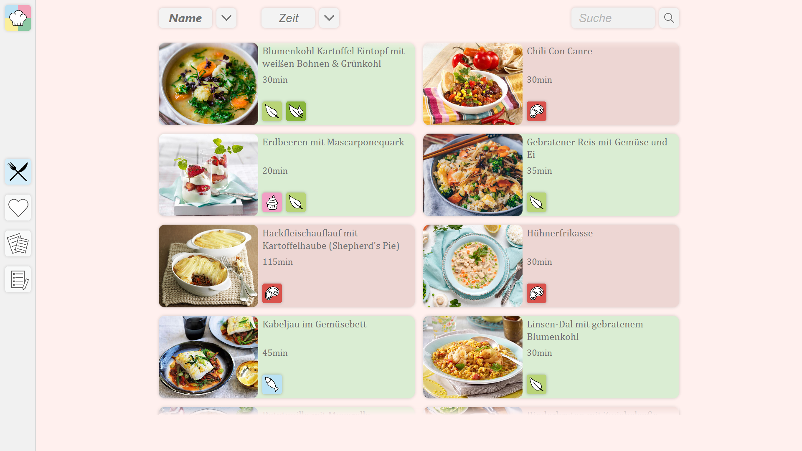
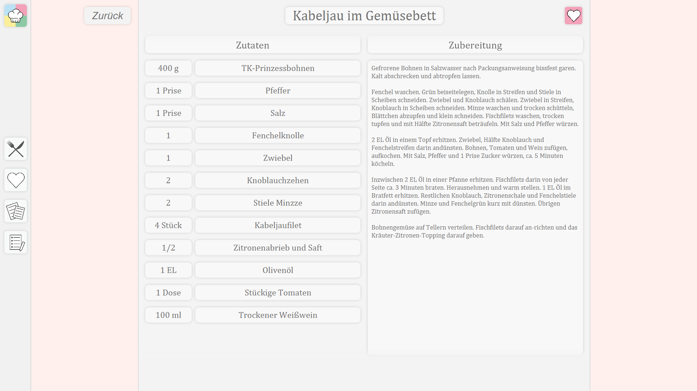

# Das Rezeptbuch

_Das Rezeptbuch_ (ger. The Recipe Book), is an easy-to-use recipe book application designed to store your favorite recipes for easy access, built with JavaFX.

## The Team

This project was created as a team effort for the university module _Computer Science_ at the Hochschule Hamm-Lippstadt by:

- Lucas Oelker
- Marvin Lüke
- Michelle Walus
